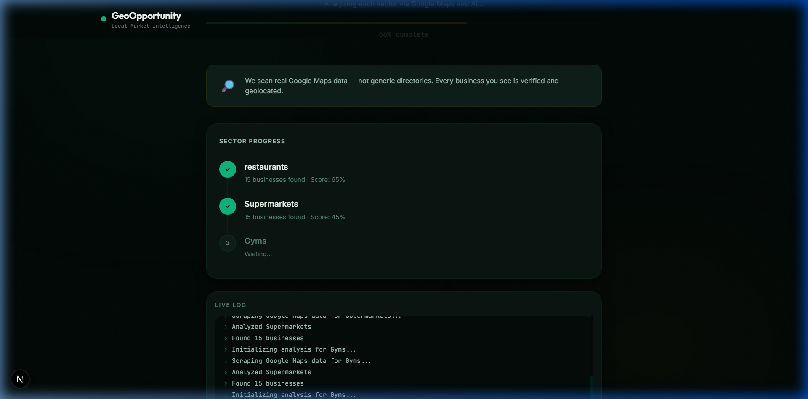

# ⚡ Geo-Opportunity Analyzer

An AI-powered full-stack web application that discovers untapped local business opportunities by analyzing Google Maps data and generating automated SWOT reports. Built with Next.js, SerpApi, Tavily, and Google Gemini.


## Features

- **Google Maps Scraping**: Instantly pull local business data (names, ratings, reviews) from Google Maps via SerpApi.
- **Deep Market Research**: Uses Tavily Search API to scan the web for competitor analysis, customer sentiment, and market gaps.
- **AI Synthesis (SWOT)**: Gemini AI processes the data to generate a SWOT matrix and assigns an Opportunity Score to each sector.
- **Vercel Serverless Ready**: Orchestrated entirely client-side to bypass Vercel's 10-second serverless execution limits, allowing for seamless real-time analysis across multiple sectors.
- **Dynamic UI**: Features beautiful micro-animations, glassmorphism design, interactive SVG gauges, and live terminal logs.



## Architecture

To avoid Vercel's strict 10s Serverless Hobby Tier timeout limits, this app uses **Client-Side Orchestration**:
1. The frontend initiates a loop across the chosen sectors.
2. For each sector, it calls `/api/analyze-sector`.
3. The API handles exactly *one* sector at a time (Scrape $\to$ Research $\to$ AI Synthesis) which finishes well within the 10-second limit (~4-5s total).
4. The client accumulates the results and updates the UI in real-time.

## Setup & Local Development

1. **Clone the repository**
   ```bash
   git clone https://github.com/chakradharreddy141-netizen/geo-market-analyser.git
   cd geo-market-analyser
   ```

2. **Install dependencies**
   ```bash
   npm install
   ```

3. **Configure Environment Variables**
   Create a `.env.local` file in the root directory:
   ```env
   TAVILY_API_KEY=your_tavily_key
   GEMINI_API_KEY=your_gemini_key
   SERPAPI_API_KEY=your_serpapi_key
   ```

4. **Run the development server**
   ```bash
   npm run dev
   ```
   Open [http://localhost:3000](http://localhost:3000) in your browser.

## Deployment

This project is fully optimized for **Vercel**. Simply import the repository into Vercel and add your environment variables to the project settings.
