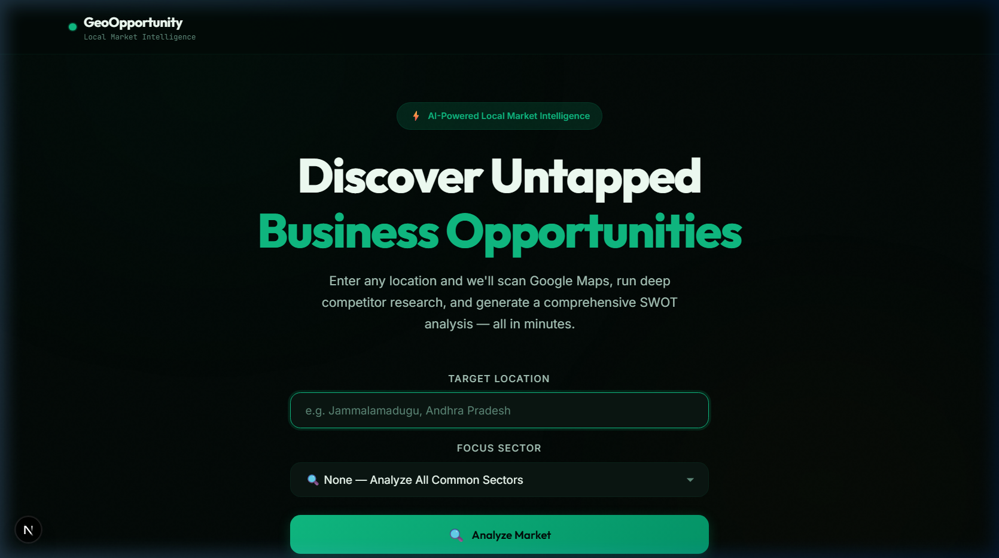
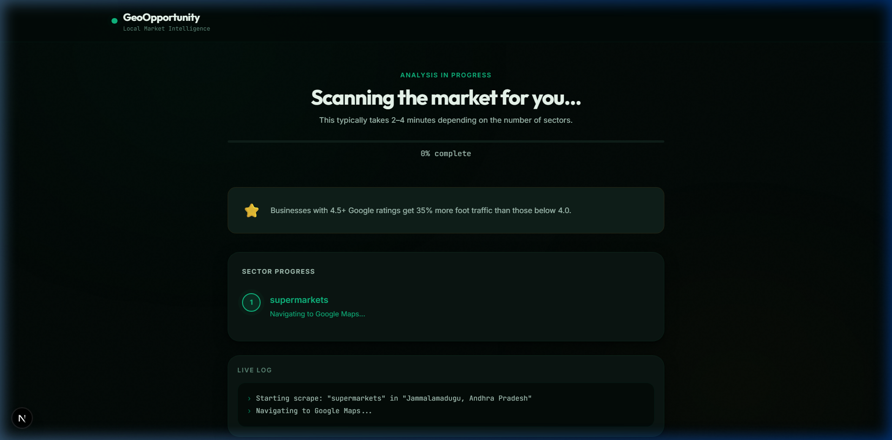
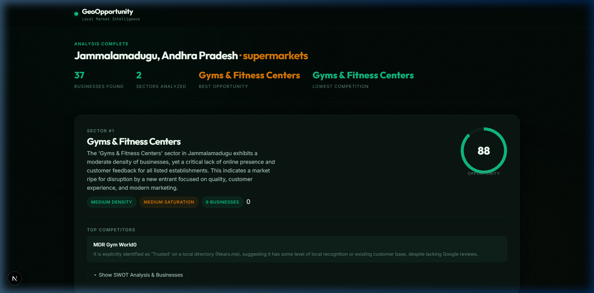
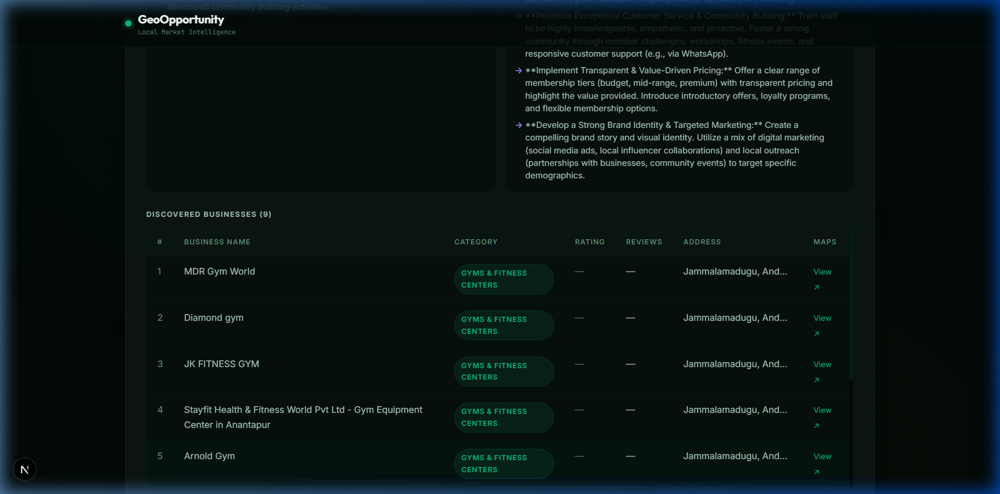

# GeoOpportunity Analyzer

An AI-powered full-stack Next.js web application that scrapes Google Maps, performs deep competitor market research, and generates interactive SWOT analyses and overtaking strategies for local business sectors.

---

## 🚀 Key Features

- **Google Maps Data Scraping**: Headless Playwright integration that scrolls, queries, and parses business details (names, categories, ratings, reviews, addresses, and maps links) with deduplication and error handling.
- **Deep Research**: Automated market queries and top competitor service/pricing investigations using the Tavily Search API.
- **Gemini AI SWOT Engine**: Analyzes density, saturation, gaps, strengths, weaknesses, and calculates a customized **Opportunity Score (0-100)** to help entrepreneurs locate market gaps.
- **SSE Real-time Tracker**: Server-Sent Events timeline and live-log terminal showcasing the scraper's actions as they happen in the background.
- **Rotating Business Insights**: Interactive crossfading tip cards explaining local competitive strategies to keep users engaged during compilation.
- **Premium UX Styling**: Designed using the **Midnight Forest & Champagne Gold** luxury theme (Obsidian background, Spruce accents, Mint glows).

---

## 📸 Screenshots

### 1. Landing Page


### 2. Loading & Progress View


### 3. Results Dashboard


### 4. Expanded SWOT & Discovered Businesses


---

## ⚙️ Setup & Installation

1. **Install Dependencies**:
   ```bash
   npm install
   ```

2. **Install Playwright Browser**:
   ```bash
   npx playwright install chromium
   ```

3. **Configure Environment variables**:
   Create a `.env.local` in the root folder:
   ```env
   TAVILY_API_KEY=your-tavily-api-key
   GEMINI_API_KEY=your-gemini-api-key
   ```

4. **Launch Local Server**:
   ```bash
   npm run dev
   ```
   Open `http://localhost:3000` in your browser.
